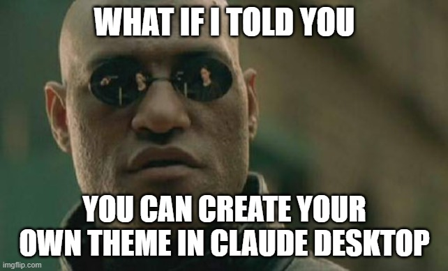
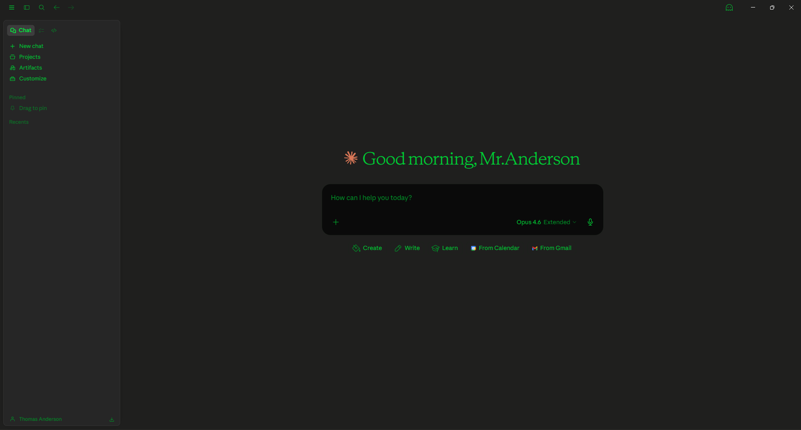

# claude-desktop-modding

<p align="center">
  
</p>

> **For humans**: You don't have to do any of this manually. Paste this README into Claude Code and say "do this." It will handle the rest.

> What if I told you... flipping 2 Electron Fuses lets you theme any Electron app.

A toolkit for theming Claude Desktop on Windows. We reverse-engineered the 3-layer security architecture, found the shortest path through it, and built a Theme Studio for designing custom themes.

**No proprietary code is included.** Share the knowledge, not the binary.

## The 3 Layers

Claude Desktop's Electron build has three security mechanisms that prevent modification:

| Layer | Mechanism | Applies to | Bypass |
|---|---|---|---|
| MSIX AppxBlockMap | Per-file SHA256 block hashes + package signature | MSIX build only | Switch to Squirrel build (`winget install Anthropic.Claude`) |
| Electron Asar Integrity | asar SHA256 hash embedded in the Electron binary | All builds | `@electron/fuses`: set `EnableEmbeddedAsarIntegrityValidation` to OFF |
| Electron Fuse: InspectArgs | Blocks `--inspect` / `--inspect-brk` flags | All builds | `@electron/fuses`: set `EnableNodeCliInspectArguments` to ON |

**Shortest path**: Install the Squirrel build → flip 2 fuses → run the injector → drop in a theme JSON. That's it.

See [docs/IMPLEMENTATION_LOG.md](docs/IMPLEMENTATION_LOG.md) and [docs/IMPLEMENTATION_LOG_v0.2.md](docs/IMPLEMENTATION_LOG_v0.2.md) for the full story — every attempt, every failure, and what finally worked.

## Quick Start

### Prerequisites

- Windows 10/11
- Node.js (v18+)
- Claude Desktop installed via `winget install Anthropic.Claude` (Squirrel build, NOT MSIX)

### Step 1: Install dependencies and flip fuses

```bash
cd tools && npm install @electron/fuses
node flip_fuses.js
```

This disables asar integrity validation and enables inspector args. Run `node read_fuses.js` to verify.

### Step 2: Inject the theme loader

```bash
cd .. && npm install @electron/asar
node tools/inject_theme_loader.js
```

This extracts the asar, patches the Electron main process with the theme loader, repacks, and deploys. One command, fully automated. Claude Desktop will restart.

### Step 3: Create your theme

Save a theme JSON to `%USERPROFILE%\.claude\theme.json`:

```json
{
  "name": "Matrix",
  "bgMain": "#0A0A0A",
  "bgSidebar": "#050505",
  "textPrimary": "#00FF41",
  "textSecondary": "#00CC33",
  "textMuted": "#008F26",
  "accentPrimary": "#00FF41",
  "borderColor": "#0A3A0A",
  "codeBg": "#020202",
  "codeText": "#00FF41",
  "headingColor": "#00FF41",
  "boldColor": "#66FFB2",
  "linkColor": "#33FF77",
  "selectionBg": "#00FF4144"
}
```

Theme applies automatically on launch. **Edit the file while Claude is running — changes are picked up within ~1 second.** Delete the file to revert to default.

Use **Theme Studio** (below) to design themes visually and export JSON.

### Matrix Theme



### Restore

To undo all modifications and restore the original Claude Desktop:

```powershell
.\tools\restore.ps1
```

## How It Works

The injector patches `index.js` — the Electron **main process** entry point. This is the privileged side: full Node.js access, no sandbox, no context isolation.

1. **On startup**: reads `~/.claude/theme.json`, converts hex colors to CSS variables (HSL), and calls `webContents.insertCSS()` on the claude.ai renderer
2. **Hot-reload**: `fs.watchFile()` monitors `theme.json` for changes and re-applies CSS within ~1 second
3. **On delete**: removes the injected CSS, restoring the default theme

Why not inject into the renderer (`index.html` or the preload script)? Because Claude Desktop's renderer is sandboxed — no `require('fs')`, no `process.env`, and `mainView.js` (the preload) controls Desktop feature detection via `contextBridge`. Touching it breaks Desktop-specific features like Cowork and MCP integrations. The main process has none of these restrictions.

## Theme Studio

A React-based theme designer that runs as a Claude artifact. No build step, no dependencies.

**How to use:**

1. Copy the contents of [`theme-studio/claude-desktop-theme-customizer.jsx`](theme-studio/claude-desktop-theme-customizer.jsx)
2. Paste it into a Claude conversation as an artifact (or ask Claude to render it)
3. Pick a preset or adjust colors with the live preview
4. **Export** your theme as JSON — use these color values when editing the asar (see Step 2 above)
5. **Import** lets you load themes shared by others

### Available Presets

All presets are themed after EarthBound / MOTHER 2 locations:

**Onett** · **Twoson** · **Threed** · **Fourside** · **Moonside** · **Summers** · **Scaraba** · **Saturn Valley** · **Magicant**

Theme Studio also supports **Import/Export** of theme JSON, so you can share presets with others.

## Repository Structure

```
claude-desktop-modding/
├── docs/
│   ├── IMPLEMENTATION_LOG.md       # v0.1 reverse-engineering narrative
│   ├── IMPLEMENTATION_LOG_v0.2.md  # v0.2/v0.3 development log
│   └── SQUIRREL_INSTALLER.md      # Squirrel build URLs + SHA256 hashes
├── tools/
│   ├── inject_theme_loader.js      # v0.3 theme loader injector (main tool)
│   ├── flip_fuses.js               # Flip Electron fuses (auto-detects version)
│   ├── read_fuses.js               # Read current fuse state
│   ├── launch_cdp.ps1              # Launch Claude with Chrome DevTools Protocol
│   ├── deploy.ps1                  # Deploy modified asar (Squirrel build)
│   └── restore.ps1                 # Restore original asar
├── theme-studio/
│   └── claude-desktop-theme-customizer.jsx  # Theme designer (Claude artifact)
└── screenshots/
    └── matrix.png                  # Matrix theme screenshot
```

## Caveats

- **Auto-updates reset everything.** Claude Desktop updates replace the version directory, resetting fuses and the asar. Re-run `flip_fuses.js` and redeploy after each update.
- **Fuse flipping is a binary patch.** It invalidates the Electron binary's code signature. Understand the security implications before proceeding.
- **asar path separators on Windows.** `@electron/asar`'s `extractFile()` can fail with paths from `listPackage()`. Use the CLI (`npx @electron/asar extract`) instead.

### If Claude Desktop won't launch

If a bad asar modification prevents Claude Desktop from starting, you don't need Claude Desktop to fix it. Open a terminal and run:

```powershell
.\tools\restore.ps1
```

Or, if you have [Claude Code](https://docs.anthropic.com/en/docs/claude-code) installed, just tell it:

> "Claude Desktop won't start. Run restore.ps1 from my claude-desktop-modding repo."

Claude Code runs in your terminal, independent of Claude Desktop.

## Security

**Share the knowledge, not the binary.**

- Do NOT redistribute Claude Desktop installers or modified asar files
- Do NOT download pre-modified binaries from untrusted sources
- Each user should generate their own modified asar using their own Claude installation

See [SECURITY.md](SECURITY.md) for a detailed risk analysis of asar modification techniques.

## Squirrel Installer

Claude Desktop is available in two builds. The browser download gives you MSIX (locked down). `winget install Anthropic.Claude` gives you the Squirrel/exe build (moddable).

Squirrel installer v1.3883.0 SHA256:
```
13fa53ddea0a362e4b91d289c7e9f1186039b79963b5a8e31409e31cac1bb591
```

See [docs/SQUIRREL_INSTALLER.md](docs/SQUIRREL_INSTALLER.md) for URLs and details.

## License

MIT. See [LICENSE](LICENSE).
